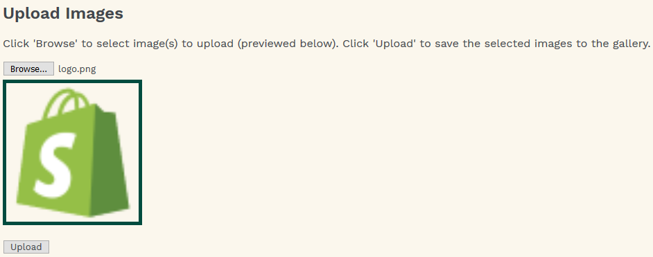
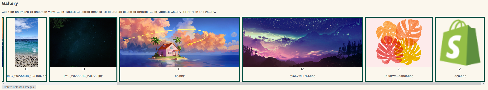

# ImageRepo (Shopify)
This is my submission for the Shopify Winter 2021 Dev Challenge, using HTML/CSS/JavaScript and AWS S3 + AWS SDK.

## How it Works
The Image Repository is a gallery aiming to provide add and delete control from a single screen. To do so, it is split up into two sections: "Upload" for selecting and uploading images to the AWS bucket, and "Gallery" for viewing and deleting images from the AWS bucket.

### Uploading Images
In the Upload section, users can click the "Browse..." button to select and add images to the gallery via their file explorer. 
Previews of the selected images will appear and hovering the "Browse..." button will display the image file names so that users can confirm their selection. 
Clicking "Upload" will upload the selected images to AWS. Uploading an image with the same name as a pre-existing image will overwrite the pre-existing image.

### Gallery
In the Gallery section, users can see all existing images and file names in the bucket. Selecting an image opens an enlargened modal view of the image, and pressing X closes the modal. 
Each image has a checkbox that can be selected to mark it for deletion. Clicking "Delete Selected Images" will delete all checked images. 

## Backend Processes
To interact with AWS, three main methods were used: viewAlbum(albumName), addPhoto(albumName), and deletePhoto(albumName, photoKey). These methods were provided by AWS and were modified for the respository.
###viewAlbum(albumName)
viewAlbum takes in an albumName and makes an httprequest to retrieve all images from the bucket with name albumName, inserting the corresponding HTML code into the gallery.
###addPhoto(albumName)
addPhoto takes the files selected by the user and uses the S3 ManagedUpload class to upload the photos to the bucket with name albumName.
### deletePhoto(albumName, photoKey)
deletePhoto deletes the photo identified by photoKey from the bucket with name albumName, if it exists. The S3 API only deletes images one at a time, so a helper function multiDelete was used to delete multiple images.  

## Challenges Encountered
Although I had previous brief experience working with AWS and storage buckets, I did not have experience specifically with S3, having used Google Cloud Storage before. 
Setting up a bucket with the right user permissions, identity pool, policies, and CORS configuration were unfamiliar processes, but reading through the AWS documentation proved to be very helpful in answering the questions I had.

## What I Enjoyed
Despite the challenges faced with using AWS, after finishing my submission I can say that AWS provided great documentation to guide me through using S3, which helped me really enjoy the learning process. 
I also enjoyed designing the interface of the repository (featuring Shopify colors!) - although there were many ways to design it, I enjoyed brainstorming the single-page dual-section approach that allows for quick add/delete operations (which is also mobile-friendly)!

## Next Steps
Due to time limitations, I was unable to add in the following features (although a few code remnants still remain). Moving forward, here are some of the things I'd love to do:
- Cache images for faster page loading times
- Implement a login system using AWS Amplify/Cognito 
- Add private user buckets and more object metadata (e.g. captions) using more of S3
- Further increase page responsiveness and UI intuitiveness (supporting back gestures on mobile, increased screen size adaptation)
- Add search functionality to the page

## Try It Out
Visit [the demo version](https://williamlongking.github.io/demo/index.html) of the challenge on my website and follow the instructions on the site.